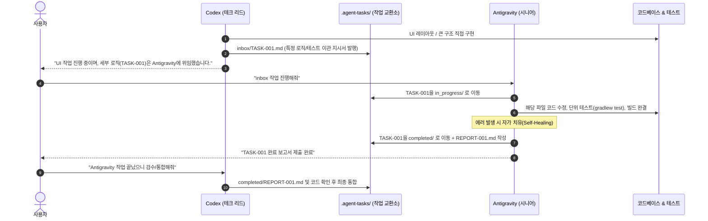
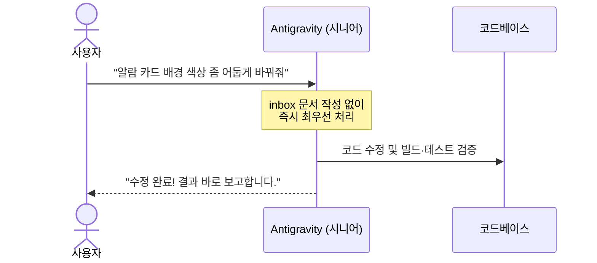

# Codex ↔ Antigravity 듀얼 핸즈온 개발 협업 명세서 (Dual-Player Collaboration Spec)

- **문서 버전**: 1.2.0
- **최종 수정일**: 2026-09-29
- **협업 패러다임**: 듀얼 핸즈온 개발자 모델 (Hands-on Tech Lead Codex + Senior Implementer Antigravity)
- **적용 대상**: LockAlarm 프로젝트 개발 세션 전원
- **관련 파일**: `AGENTS.md`, `.agent-tasks/`

---

## 1. 아키텍처 개요 및 핵심 철학

본 명세서는 **Codex(테크 리드 & 개발자)** 와 **Antigravity(시니어 개발자 & 자율 해결사)** 가 대등하게 소스 코드를 구현하면서, 필요 시 작업을 유연하게 이관(Handoff) 및 분업하고, **사용자의 실시간 직접 지시(Ad-hoc)** 를 매끄럽게 처리하기 위한 엔지니어링 프로토콜을 규정합니다.

### 4대 기본 원칙
1. **듀얼 핸즈온 (Dual Hands-on Implementation)**: Codex는 말로만 지시하는 관리자가 아니라 **직접 코드를 짜고 커밋하는 테크 리드**입니다. Antigravity 역시 **스스로 판단하고 코딩과 테스트를 완결하는 시니어 엔지니어**입니다.
2. **선택적 이관 (Selective Delegation)**: Codex가 혼자 다 만들기보다 병렬 개발이 필요하거나, 복잡한 세부 로직, 단위 테스트 보강, 버그 디버깅이 필요할 때 작업을 `.agent-tasks/inbox/TASK-xxx.md`로 떼어주어 Antigravity에게 위임합니다.
3. **작업 파일 격리 (File / Domain Isolation)**: 두 개발자가 동시에 소스 코드를 수정할 때는 서로 다른 파일이나 모듈을 작업 범위로 분리하여 충돌(Merge Conflict)을 사전에 차단합니다.
4. **사용자 최우선 원칙 (Human-Priority Overwrite)**: 대기 중인 이관 큐(inbox)보다 사용자의 실시간 대화창 직접 지시가 언제나 최우선으로 즉시 개별 수행됩니다.

---

## 2. 역할 및 책임 (RACI) 매트릭스

| 업무 영역 | 사용자 (Human Owner) | Codex (테크 리드 & 개발자) | Antigravity (시니어 개발자) |
| :--- | :---: | :---: | :---: |
| **전체 기획 & 아키텍처 설계** | **Accountable (최종 승인)** | **Responsible (주도적 설계)** | Consulted (의견 제시) |
| **직접 코드 구현 및 개발** | Informed (진행 확인) | **Responsible (본인 분량 직접 구현)** | **Responsible (본인/이관 분량 직접 구현)** |
| **업무 이관 (WBS 작업 분해)** | Informed (선택적 요청) | **Responsible (지시서 발행)** | Informed (수령) |
| **이관 작업 자율 완결** | Informed (결과 확인) | Consulted (검수) | **Responsible (코딩·테스트·자가치유 전담)** |
| **단위 테스트 & 빌드 검증** | Informed (증거 확인) | **Responsible (본인 변경분 검증)** | **Responsible (현재 테스트 결과와 회귀 검증)** |
| **사용자 실시간 직접 지시** | **Responsible (직접 발의)** | **Responsible (직접 수행)** | **Responsible (최우선 즉시 수행)** |
| **코드 리뷰 및 최종 통합** | Consulted (선택적 개입) | **Responsible (전체 정합성 검수)** | Consulted (변경 내역 보고) |

---

## 3. 작업 교환소 (.agent-tasks/) 구조 및 운영 규칙

Codex가 Antigravity에게 작업을 분업·이관할 때 사용하는 디렉토리입니다.

```text
alarm/
├── .agent-tasks/
│   ├── README.md               # 교환소 프로토콜 안내
│   ├── inbox/                  # [대기] Codex가 발행한 이관 작업 지시서 (TASK-xxx.md)
│   ├── in_progress/            # [진행] Antigravity가 인수하여 현재 코딩 중인 작업
│   ├── completed/              # [완료] 완료된 지시서와 Antigravity의 결과 보고서 (REPORT-xxx.md)
│   └── templates/              # 표준 작성 템플릿 (TASK_TEMPLATE, REPORT_TEMPLATE)
```

---

## 4. 협업 워크플로우 (2가지 모드)

### 모드 A: 분업 및 작업 이관 모드 (Codex ➔ Antigravity)
Codex가 큰 모듈을 잡고 개발하면서, 특정 하위 모듈이나 검증 작업을 Antigravity에게 넘겨 병렬 처리할 때 사용합니다.



### 모드 B: 사용자 직접 지시 모드 (Ad-hoc)
사용자가 Codex 또는 Antigravity에게 작업을 직접 개별 할당할 때 사용합니다.



---

## 5. 동시 작업 시 충돌 방지 및 안전 수칙 (Safety Rules)

1. **파일 단위 격리 (Strict File Scope)**:
   * Codex가 Antigravity에게 지시서를 발행할 때는 반드시 `수정 대상 파일(Target Files)`을 한정합니다.
   * Codex 본인이 수정 중인 파일과 Antigravity가 수정할 파일이 겹치지 않게 분리합니다.
     * *예: Codex는 `MainActivity.kt`(화면) 개발, Antigravity는 `PlaybackVolumeRampPolicy.kt`(음량 정책) 개발.*
2. **Git 무결성 확인**:
   * 작업을 시작하기 전 `git status`로 현재 워킹 디렉터리 상태를 확인하고, 작업 완료 후에는 단위 테스트(`gradlew.bat testDebugUnitTest`)를 실행하여 회귀 여부를 검증합니다. 테스트 수는 고정값이 아니라 실제 실행 결과에서 확인하며, 미실행은 `NOT RUN`으로 보고합니다.
3. **단일 작업 집중**:
   * Antigravity는 한 번에 하나의 지시서만 `in_progress/`에 두고 완결합니다.

## 6. 업무데스크 실행 모드 (1.2.0 추가)

기존 모드 A·B의 역할과 한글 양식은 유지합니다. 로컬 화면과 전역 `antigravity-handoff` 스킬은 **같은 교환소를 사용하는 실행 어댑터**입니다. 별도 업무 큐를 만들지 않습니다.

| 단계 | 교환소 | 실행·검토 상태 |
| :--- | :--- | :--- |
| 접수 | `inbox/TASK-*.md` | `QUEUED` |
| 수행 | `in_progress/TASK-*.md` | `RUNNING` 또는 수동 진행 |
| CLI 권한 부족 | 같은 진행 지시서 보존 | `AWAITING_PERMISSION`, Antigravity 담당 유지 |
| 자체검수 후 보고 제출 | `completed/TASK-*.md`, `REPORT-*.md` | `REVIEW`, Codex 검토 대기 |
| Codex 검토 기록 | 원문 보존 | `REVIEWED` |
| Codex 검토 + 사용자 확인 | 원문 보존 | `DONE` |

자동 실행에서는 어댑터가 폴더 이동·원본 보고 저장을 맡습니다. 수동 실행에서는 기존 절차대로 Antigravity가 처리합니다. 사용자 직접 지시는 사전 양식 작성을 강제하지 않으며, 실행 중인 다른 작업과 파일 충돌부터 확인합니다.

헤드리스 CLI의 권한 거부는 대화형 승인 창과 다릅니다. 요청 행동을 확인하고 실제 CLI 권한을 설정한 후 같은 대화로 명시적으로 재개합니다. 전체 허용이나 자동 권한 변경은 하지 않습니다. CLI 실행 중 전체 프로젝트 해시 검사가 적용되므로 동일 checkout의 병렬 편집은 피합니다.

기존 수동 지시서·보고는 표시만으로 자동 실행·검증 성공으로 간주하지 않습니다. 백그라운드 Codex 자동 호출, IDE 직접 지시 자동 수집, 상시 할당량 감시는 포함하지 않습니다. [운영 안내](workdesk-operation.md)에 실행 방법과 검증 경계를 기록합니다.
